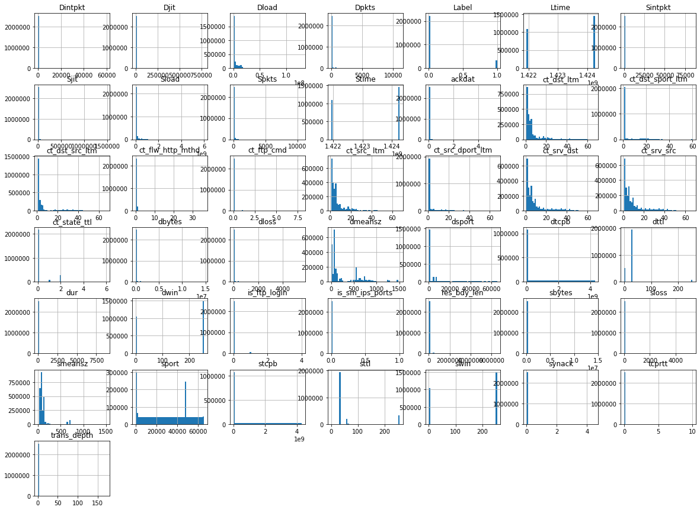

## Description : 
    The raw network packets of the UNSW-NB 15 dataset was created by the IXIA PerfectStorm tool in the Cyber Range Lab of the Australian Centre for Cyber Security (ACCS) for generating a hybrid of real modern normal activities and synthetic contemporary attack behaviours.

## Imports


```python
import numpy as np
import pandas as pd
import matplotlib.pyplot as plt
from pandas.plotting import scatter_matrix
from sklearn.metrics import confusion_matrix
from sklearn.model_selection import cross_val_score
from sklearn.model_selection import cross_val_predict
from sklearn.metrics import accuracy_score
```


```python
## Custom Functions
```


```python
### Missing valus Table
def missing_zero_values_table(df):
        zero_val = (df == 0.00).astype(int).sum(axis=0)
        mis_val = df.isnull().sum()
        mis_val_percent = 100 * df.isnull().sum() / len(df)
        mz_table = pd.concat([zero_val, mis_val, mis_val_percent], axis=1)
        mz_table = mz_table.rename(
        columns = {0 : 'Zero Values', 1 : 'Missing Values', 2 : '% of Total Values'})
        mz_table['Total Zero Missing Values'] = mz_table['Zero Values'] + mz_table['Missing Values']
        mz_table['% Total Zero Missing Values'] = 100 * mz_table['Total Zero Missing Values'] / len(df)
        mz_table['Data Type'] = df.dtypes
        mz_table = mz_table[
            mz_table.iloc[:,1] != 0].sort_values(
        '% of Total Values', ascending=False).round(1)
        print ("Your selected dataframe has " + str(df.shape[1]) + " columns and " + str(df.shape[0]) + " Rows.\n"      
            "There are " + str(mz_table.shape[0]) +
              " columns that have missing values.")
#         mz_table.to_excel('D:/sampledata/missing_and_zero_values.xlsx', freeze_panes=(1,0), index = False)
        return mz_table
```

## 1. Read data set in Data frame


```python
UNSW_NB15 = pd.read_csv("UNSW-NB15.csv")
```

    C:\Users\PC\Anaconda3\lib\site-packages\IPython\core\interactiveshell.py:3057: DtypeWarning: Columns (47) have mixed types. Specify dtype option on import or set low_memory=False.
      interactivity=interactivity, compiler=compiler, result=result)
    


```python
UNSW_NB15_features = pd.read_csv("UNSW-NB15_features.csv")
UNSW_NB15_LIST_EVENTS = pd.read_csv("UNSW-NB15_LIST_EVENTS.csv")
```

## 2. Identify attributes and class name

##### UNSW_NB15 Dataset has 49 columns and 2539738 records


```python
UNSW_NB15.head()
```


<div>
<style scoped>
    .dataframe tbody tr th:only-of-type {
        vertical-align: middle;
    }

    .dataframe tbody tr th {
        vertical-align: top;
    }

    .dataframe thead th {
        text-align: right;
    }
</style>
<table border="1" class="dataframe">
  <thead>
    <tr style="text-align: right;">
      <th></th>
      <th>59.166.0.3</th>
      <th>56716</th>
      <th>149.171.126.8</th>
      <th>143</th>
      <th>tcp</th>
      <th>FIN</th>
      <th>0.82546002</th>
      <th>7812</th>
      <th>16236</th>
      <th>31</th>
      <th>...</th>
      <th>0.6</th>
      <th>2</th>
      <th>7</th>
      <th>1</th>
      <th>4</th>
      <th>1.1</th>
      <th>1.2</th>
      <th>1.3</th>
      <th>Unnamed: 47</th>
      <th>0.7</th>
    </tr>
  </thead>
  <tbody>
    <tr>
      <th>0</th>
      <td>59.166.0.0</td>
      <td>43467</td>
      <td>149.171.126.6</td>
      <td>49729</td>
      <td>tcp</td>
      <td>FIN</td>
      <td>0.101815</td>
      <td>4238</td>
      <td>65628</td>
      <td>31</td>
      <td>...</td>
      <td>0</td>
      <td>7</td>
      <td>4</td>
      <td>1</td>
      <td>6</td>
      <td>1</td>
      <td>1</td>
      <td>1</td>
      <td>NaN</td>
      <td>0</td>
    </tr>
    <tr>
      <th>1</th>
      <td>59.166.0.5</td>
      <td>41289</td>
      <td>149.171.126.2</td>
      <td>9574</td>
      <td>tcp</td>
      <td>FIN</td>
      <td>0.044003</td>
      <td>2750</td>
      <td>29104</td>
      <td>31</td>
      <td>...</td>
      <td>0</td>
      <td>3</td>
      <td>5</td>
      <td>3</td>
      <td>3</td>
      <td>1</td>
      <td>1</td>
      <td>1</td>
      <td>NaN</td>
      <td>0</td>
    </tr>
    <tr>
      <th>2</th>
      <td>59.166.0.9</td>
      <td>43785</td>
      <td>149.171.126.0</td>
      <td>6881</td>
      <td>tcp</td>
      <td>FIN</td>
      <td>2.790830</td>
      <td>10476</td>
      <td>395734</td>
      <td>31</td>
      <td>...</td>
      <td>0</td>
      <td>11</td>
      <td>4</td>
      <td>3</td>
      <td>2</td>
      <td>1</td>
      <td>1</td>
      <td>1</td>
      <td>NaN</td>
      <td>0</td>
    </tr>
    <tr>
      <th>3</th>
      <td>59.166.0.8</td>
      <td>40691</td>
      <td>149.171.126.9</td>
      <td>6881</td>
      <td>tcp</td>
      <td>FIN</td>
      <td>2.633500</td>
      <td>13350</td>
      <td>548216</td>
      <td>31</td>
      <td>...</td>
      <td>0</td>
      <td>16</td>
      <td>7</td>
      <td>7</td>
      <td>1</td>
      <td>1</td>
      <td>1</td>
      <td>1</td>
      <td>NaN</td>
      <td>0</td>
    </tr>
    <tr>
      <th>4</th>
      <td>59.166.0.3</td>
      <td>20393</td>
      <td>149.171.126.3</td>
      <td>5190</td>
      <td>tcp</td>
      <td>FIN</td>
      <td>0.115048</td>
      <td>1958</td>
      <td>2308</td>
      <td>31</td>
      <td>...</td>
      <td>0</td>
      <td>2</td>
      <td>6</td>
      <td>1</td>
      <td>4</td>
      <td>1</td>
      <td>1</td>
      <td>1</td>
      <td>NaN</td>
      <td>0</td>
    </tr>
  </tbody>
</table>
<p>5 rows × 49 columns</p>
</div>


```python
UNSW_NB15.describe()
```


<div>
<style scoped>
    .dataframe tbody tr th:only-of-type {
        vertical-align: middle;
    }

    .dataframe tbody tr th {
        vertical-align: top;
    }

    .dataframe thead th {
        text-align: right;
    }
</style>
<table border="1" class="dataframe">
  <thead>
    <tr style="text-align: right;">
      <th></th>
      <th>56716</th>
      <th>143</th>
      <th>0.82546002</th>
      <th>7812</th>
      <th>16236</th>
      <th>31</th>
      <th>29</th>
      <th>30</th>
      <th>32</th>
      <th>75090.25</th>
      <th>...</th>
      <th>0.5</th>
      <th>0.6</th>
      <th>2</th>
      <th>7</th>
      <th>1</th>
      <th>4</th>
      <th>1.1</th>
      <th>1.2</th>
      <th>1.3</th>
      <th>0.7</th>
    </tr>
  </thead>
  <tbody>
    <tr>
      <th>count</th>
      <td>2.539738e+06</td>
      <td>2.539738e+06</td>
      <td>2.539738e+06</td>
      <td>2.539738e+06</td>
      <td>2.539738e+06</td>
      <td>2.539738e+06</td>
      <td>2.539738e+06</td>
      <td>2.539738e+06</td>
      <td>2.539738e+06</td>
      <td>2.539738e+06</td>
      <td>...</td>
      <td>2.539738e+06</td>
      <td>2.539738e+06</td>
      <td>2.539738e+06</td>
      <td>2.539738e+06</td>
      <td>2.539738e+06</td>
      <td>2.539738e+06</td>
      <td>2.539738e+06</td>
      <td>2.539738e+06</td>
      <td>2.539738e+06</td>
      <td>2.539738e+06</td>
    </tr>
    <tr>
      <th>mean</th>
      <td>3.053692e+04</td>
      <td>1.123510e+04</td>
      <td>6.588633e-01</td>
      <td>4.340071e+03</td>
      <td>3.643202e+04</td>
      <td>6.278151e+01</td>
      <td>3.077044e+01</td>
      <td>5.164537e+00</td>
      <td>1.633142e+01</td>
      <td>3.694929e+07</td>
      <td>...</td>
      <td>1.735336e-02</td>
      <td>2.056039e-02</td>
      <td>9.207915e+00</td>
      <td>8.989884e+00</td>
      <td>6.439729e+00</td>
      <td>6.901641e+00</td>
      <td>4.642573e+00</td>
      <td>3.593033e+00</td>
      <td>6.846560e+00</td>
      <td>1.265024e-01</td>
    </tr>
    <tr>
      <th>std</th>
      <td>2.044121e+04</td>
      <td>1.843820e+04</td>
      <td>1.392577e+01</td>
      <td>5.640941e+04</td>
      <td>1.611053e+05</td>
      <td>7.462671e+01</td>
      <td>4.285193e+01</td>
      <td>2.251837e+01</td>
      <td>5.659790e+01</td>
      <td>1.186042e+08</td>
      <td>...</td>
      <td>1.334651e-01</td>
      <td>1.843731e-01</td>
      <td>1.083708e+01</td>
      <td>1.082282e+01</td>
      <td>8.162331e+00</td>
      <td>8.205342e+00</td>
      <td>8.478002e+00</td>
      <td>6.174759e+00</td>
      <td>1.125880e+01</td>
      <td>3.324148e-01</td>
    </tr>
    <tr>
      <th>min</th>
      <td>0.000000e+00</td>
      <td>0.000000e+00</td>
      <td>0.000000e+00</td>
      <td>0.000000e+00</td>
      <td>0.000000e+00</td>
      <td>0.000000e+00</td>
      <td>0.000000e+00</td>
      <td>0.000000e+00</td>
      <td>0.000000e+00</td>
      <td>0.000000e+00</td>
      <td>...</td>
      <td>0.000000e+00</td>
      <td>0.000000e+00</td>
      <td>1.000000e+00</td>
      <td>1.000000e+00</td>
      <td>1.000000e+00</td>
      <td>1.000000e+00</td>
      <td>1.000000e+00</td>
      <td>1.000000e+00</td>
      <td>1.000000e+00</td>
      <td>0.000000e+00</td>
    </tr>
    <tr>
      <th>25%</th>
      <td>1.123100e+04</td>
      <td>5.300000e+01</td>
      <td>1.037000e-03</td>
      <td>2.000000e+02</td>
      <td>1.780000e+02</td>
      <td>3.100000e+01</td>
      <td>2.900000e+01</td>
      <td>0.000000e+00</td>
      <td>0.000000e+00</td>
      <td>1.353775e+05</td>
      <td>...</td>
      <td>0.000000e+00</td>
      <td>0.000000e+00</td>
      <td>2.000000e+00</td>
      <td>2.000000e+00</td>
      <td>2.000000e+00</td>
      <td>2.000000e+00</td>
      <td>1.000000e+00</td>
      <td>1.000000e+00</td>
      <td>1.000000e+00</td>
      <td>0.000000e+00</td>
    </tr>
    <tr>
      <th>50%</th>
      <td>3.169000e+04</td>
      <td>8.000000e+01</td>
      <td>1.586400e-02</td>
      <td>1.470000e+03</td>
      <td>1.820000e+03</td>
      <td>3.100000e+01</td>
      <td>2.900000e+01</td>
      <td>3.000000e+00</td>
      <td>4.000000e+00</td>
      <td>5.893038e+05</td>
      <td>...</td>
      <td>0.000000e+00</td>
      <td>0.000000e+00</td>
      <td>5.000000e+00</td>
      <td>5.000000e+00</td>
      <td>3.000000e+00</td>
      <td>4.000000e+00</td>
      <td>1.000000e+00</td>
      <td>1.000000e+00</td>
      <td>2.000000e+00</td>
      <td>0.000000e+00</td>
    </tr>
    <tr>
      <th>75%</th>
      <td>4.743900e+04</td>
      <td>1.497000e+04</td>
      <td>2.147538e-01</td>
      <td>3.182000e+03</td>
      <td>1.490800e+04</td>
      <td>3.100000e+01</td>
      <td>2.900000e+01</td>
      <td>7.000000e+00</td>
      <td>1.400000e+01</td>
      <td>2.038365e+06</td>
      <td>...</td>
      <td>0.000000e+00</td>
      <td>0.000000e+00</td>
      <td>1.000000e+01</td>
      <td>1.000000e+01</td>
      <td>6.000000e+00</td>
      <td>7.000000e+00</td>
      <td>2.000000e+00</td>
      <td>1.000000e+00</td>
      <td>5.000000e+00</td>
      <td>0.000000e+00</td>
    </tr>
    <tr>
      <th>max</th>
      <td>6.553500e+04</td>
      <td>6.553500e+04</td>
      <td>8.786638e+03</td>
      <td>1.435577e+07</td>
      <td>1.465753e+07</td>
      <td>2.550000e+02</td>
      <td>2.540000e+02</td>
      <td>5.319000e+03</td>
      <td>5.507000e+03</td>
      <td>5.988000e+09</td>
      <td>...</td>
      <td>4.000000e+00</td>
      <td>8.000000e+00</td>
      <td>6.700000e+01</td>
      <td>6.700000e+01</td>
      <td>6.700000e+01</td>
      <td>6.700000e+01</td>
      <td>6.700000e+01</td>
      <td>6.000000e+01</td>
      <td>6.700000e+01</td>
      <td>1.000000e+00</td>
    </tr>
  </tbody>
</table>
<p>8 rows × 43 columns</p>
</div>


#### UNSW_NB15_features 48 features and 1 label


```python
UNSW_NB15_features
```


<div>
<style scoped>
    .dataframe tbody tr th:only-of-type {
        vertical-align: middle;
    }

    .dataframe tbody tr th {
        vertical-align: top;
    }

    .dataframe thead th {
        text-align: right;
    }
</style>
<table border="1" class="dataframe">
  <thead>
    <tr style="text-align: right;">
      <th></th>
      <th>No.</th>
      <th>Name</th>
      <th>Type</th>
      <th>Description</th>
    </tr>
  </thead>
  <tbody>
    <tr>
      <th>0</th>
      <td>1</td>
      <td>srcip</td>
      <td>nominal</td>
      <td>Source IP address</td>
    </tr>
    <tr>
      <th>1</th>
      <td>2</td>
      <td>sport</td>
      <td>integer</td>
      <td>Source port number</td>
    </tr>
    <tr>
      <th>2</th>
      <td>3</td>
      <td>dstip</td>
      <td>nominal</td>
      <td>Destination IP address</td>
    </tr>
    <tr>
      <th>3</th>
      <td>4</td>
      <td>dsport</td>
      <td>integer</td>
      <td>Destination port number</td>
    </tr>
    <tr>
      <th>4</th>
      <td>5</td>
      <td>proto</td>
      <td>nominal</td>
      <td>Transaction protocol</td>
    </tr>
    <tr>
      <th>5</th>
      <td>6</td>
      <td>state</td>
      <td>nominal</td>
      <td>Indicates to the state and its dependent proto...</td>
    </tr>
    <tr>
      <th>6</th>
      <td>7</td>
      <td>dur</td>
      <td>Float</td>
      <td>Record total duration</td>
    </tr>
    <tr>
      <th>7</th>
      <td>8</td>
      <td>sbytes</td>
      <td>Integer</td>
      <td>Source to destination transaction bytes</td>
    </tr>
    <tr>
      <th>8</th>
      <td>9</td>
      <td>dbytes</td>
      <td>Integer</td>
      <td>Destination to source transaction bytes</td>
    </tr>
    <tr>
      <th>9</th>
      <td>10</td>
      <td>sttl</td>
      <td>Integer</td>
      <td>Source to destination time to live value</td>
    </tr>
    <tr>
      <th>10</th>
      <td>11</td>
      <td>dttl</td>
      <td>Integer</td>
      <td>Destination to source time to live value</td>
    </tr>
    <tr>
      <th>11</th>
      <td>12</td>
      <td>sloss</td>
      <td>Integer</td>
      <td>Source packets retransmitted or dropped</td>
    </tr>
    <tr>
      <th>12</th>
      <td>13</td>
      <td>dloss</td>
      <td>Integer</td>
      <td>Destination packets retransmitted or dropped</td>
    </tr>
    <tr>
      <th>13</th>
      <td>14</td>
      <td>service</td>
      <td>nominal</td>
      <td>http, ftp, smtp, ssh, dns, ftp-data ,irc  and ...</td>
    </tr>
    <tr>
      <th>14</th>
      <td>15</td>
      <td>Sload</td>
      <td>Float</td>
      <td>Source bits per second</td>
    </tr>
    <tr>
      <th>15</th>
      <td>16</td>
      <td>Dload</td>
      <td>Float</td>
      <td>Destination bits per second</td>
    </tr>
    <tr>
      <th>16</th>
      <td>17</td>
      <td>Spkts</td>
      <td>integer</td>
      <td>Source to destination packet count</td>
    </tr>
    <tr>
      <th>17</th>
      <td>18</td>
      <td>Dpkts</td>
      <td>integer</td>
      <td>Destination to source packet count</td>
    </tr>
    <tr>
      <th>18</th>
      <td>19</td>
      <td>swin</td>
      <td>integer</td>
      <td>Source TCP window advertisement value</td>
    </tr>
    <tr>
      <th>19</th>
      <td>20</td>
      <td>dwin</td>
      <td>integer</td>
      <td>Destination TCP window advertisement value</td>
    </tr>
    <tr>
      <th>20</th>
      <td>21</td>
      <td>stcpb</td>
      <td>integer</td>
      <td>Source TCP base sequence number</td>
    </tr>
    <tr>
      <th>21</th>
      <td>22</td>
      <td>dtcpb</td>
      <td>integer</td>
      <td>Destination TCP base sequence number</td>
    </tr>
    <tr>
      <th>22</th>
      <td>23</td>
      <td>smeansz</td>
      <td>integer</td>
      <td>Mean of the ?ow packet size transmitted by the...</td>
    </tr>
    <tr>
      <th>23</th>
      <td>24</td>
      <td>dmeansz</td>
      <td>integer</td>
      <td>Mean of the ?ow packet size transmitted by the...</td>
    </tr>
    <tr>
      <th>24</th>
      <td>25</td>
      <td>trans_depth</td>
      <td>integer</td>
      <td>Represents the pipelined depth into the connec...</td>
    </tr>
    <tr>
      <th>25</th>
      <td>26</td>
      <td>res_bdy_len</td>
      <td>integer</td>
      <td>Actual uncompressed content size of the data t...</td>
    </tr>
    <tr>
      <th>26</th>
      <td>27</td>
      <td>Sjit</td>
      <td>Float</td>
      <td>Source jitter (mSec)</td>
    </tr>
    <tr>
      <th>27</th>
      <td>28</td>
      <td>Djit</td>
      <td>Float</td>
      <td>Destination jitter (mSec)</td>
    </tr>
    <tr>
      <th>28</th>
      <td>29</td>
      <td>Stime</td>
      <td>Timestamp</td>
      <td>record start time</td>
    </tr>
    <tr>
      <th>29</th>
      <td>30</td>
      <td>Ltime</td>
      <td>Timestamp</td>
      <td>record last time</td>
    </tr>
    <tr>
      <th>30</th>
      <td>31</td>
      <td>Sintpkt</td>
      <td>Float</td>
      <td>Source interpacket arrival time (mSec)</td>
    </tr>
    <tr>
      <th>31</th>
      <td>32</td>
      <td>Dintpkt</td>
      <td>Float</td>
      <td>Destination interpacket arrival time (mSec)</td>
    </tr>
    <tr>
      <th>32</th>
      <td>33</td>
      <td>tcprtt</td>
      <td>Float</td>
      <td>TCP connection setup round-trip time, the sum ...</td>
    </tr>
    <tr>
      <th>33</th>
      <td>34</td>
      <td>synack</td>
      <td>Float</td>
      <td>TCP connection setup time, the time between th...</td>
    </tr>
    <tr>
      <th>34</th>
      <td>35</td>
      <td>ackdat</td>
      <td>Float</td>
      <td>TCP connection setup time, the time between th...</td>
    </tr>
    <tr>
      <th>35</th>
      <td>36</td>
      <td>is_sm_ips_ports</td>
      <td>Binary</td>
      <td>If source (1) and destination (3)IP addresses ...</td>
    </tr>
    <tr>
      <th>36</th>
      <td>37</td>
      <td>ct_state_ttl</td>
      <td>Integer</td>
      <td>No. for each state (6) according to specific r...</td>
    </tr>
    <tr>
      <th>37</th>
      <td>38</td>
      <td>ct_flw_http_mthd</td>
      <td>Integer</td>
      <td>No. of flows that has methods such as Get and ...</td>
    </tr>
    <tr>
      <th>38</th>
      <td>39</td>
      <td>is_ftp_login</td>
      <td>Binary</td>
      <td>If the ftp session is accessed by user and pas...</td>
    </tr>
    <tr>
      <th>39</th>
      <td>40</td>
      <td>ct_ftp_cmd</td>
      <td>integer</td>
      <td>No of flows that has a command in ftp session.</td>
    </tr>
    <tr>
      <th>40</th>
      <td>41</td>
      <td>ct_srv_src</td>
      <td>integer</td>
      <td>No. of connections that contain the same servi...</td>
    </tr>
    <tr>
      <th>41</th>
      <td>42</td>
      <td>ct_srv_dst</td>
      <td>integer</td>
      <td>No. of connections that contain the same servi...</td>
    </tr>
    <tr>
      <th>42</th>
      <td>43</td>
      <td>ct_dst_ltm</td>
      <td>integer</td>
      <td>No. of connections of the same destination add...</td>
    </tr>
    <tr>
      <th>43</th>
      <td>44</td>
      <td>ct_src_ ltm</td>
      <td>integer</td>
      <td>No. of connections of the same source address ...</td>
    </tr>
    <tr>
      <th>44</th>
      <td>45</td>
      <td>ct_src_dport_ltm</td>
      <td>integer</td>
      <td>No of connections of the same source address (...</td>
    </tr>
    <tr>
      <th>45</th>
      <td>46</td>
      <td>ct_dst_sport_ltm</td>
      <td>integer</td>
      <td>No of connections of the same destination addr...</td>
    </tr>
    <tr>
      <th>46</th>
      <td>47</td>
      <td>ct_dst_src_ltm</td>
      <td>integer</td>
      <td>No of connections of the same source (1) and t...</td>
    </tr>
    <tr>
      <th>47</th>
      <td>48</td>
      <td>attack_cat</td>
      <td>nominal</td>
      <td>The name of each attack category. In this data...</td>
    </tr>
    <tr>
      <th>48</th>
      <td>49</td>
      <td>Label</td>
      <td>binary</td>
      <td>0 for normal and 1 for attack records</td>
    </tr>
  </tbody>
</table>
</div>


####  208 UNSW_NB15_LIST_EVENTS


```python
UNSW_NB15_LIST_EVENTS
```


<div>
<style scoped>
    .dataframe tbody tr th:only-of-type {
        vertical-align: middle;
    }

    .dataframe tbody tr th {
        vertical-align: top;
    }

    .dataframe thead th {
        text-align: right;
    }
</style>
<table border="1" class="dataframe">
  <thead>
    <tr style="text-align: right;">
      <th></th>
      <th>Attack category</th>
      <th>Attack subcategory</th>
      <th>Number of events</th>
    </tr>
  </thead>
  <tbody>
    <tr>
      <th>0</th>
      <td>normal</td>
      <td>NaN</td>
      <td>2218761</td>
    </tr>
    <tr>
      <th>1</th>
      <td>Fuzzers</td>
      <td>FTP</td>
      <td>558</td>
    </tr>
    <tr>
      <th>2</th>
      <td>Fuzzers</td>
      <td>HTTP</td>
      <td>1497</td>
    </tr>
    <tr>
      <th>3</th>
      <td>Fuzzers</td>
      <td>RIP</td>
      <td>3550</td>
    </tr>
    <tr>
      <th>4</th>
      <td>Fuzzers</td>
      <td>SMB</td>
      <td>5245</td>
    </tr>
    <tr>
      <th>5</th>
      <td>Fuzzers</td>
      <td>Syslog</td>
      <td>1851</td>
    </tr>
    <tr>
      <th>6</th>
      <td>Fuzzers</td>
      <td>PPTP</td>
      <td>1583</td>
    </tr>
    <tr>
      <th>7</th>
      <td>Fuzzers</td>
      <td>FTP</td>
      <td>248</td>
    </tr>
    <tr>
      <th>8</th>
      <td>Fuzzers</td>
      <td>DCERPC</td>
      <td>164</td>
    </tr>
    <tr>
      <th>9</th>
      <td>Fuzzers</td>
      <td>OSPF</td>
      <td>993</td>
    </tr>
    <tr>
      <th>10</th>
      <td>Fuzzers</td>
      <td>TFTP</td>
      <td>193</td>
    </tr>
    <tr>
      <th>11</th>
      <td>Fuzzers</td>
      <td>DCERPC</td>
      <td>455</td>
    </tr>
    <tr>
      <th>12</th>
      <td>Fuzzers</td>
      <td>OSPF</td>
      <td>1746</td>
    </tr>
    <tr>
      <th>13</th>
      <td>Fuzzers</td>
      <td>BGP</td>
      <td>6163</td>
    </tr>
    <tr>
      <th>14</th>
      <td>Reconnaissance</td>
      <td>Telnet</td>
      <td>6</td>
    </tr>
    <tr>
      <th>15</th>
      <td>Reconnaissance</td>
      <td>SNMP</td>
      <td>69</td>
    </tr>
    <tr>
      <th>16</th>
      <td>Reconnaissance</td>
      <td>SunRPC Portmapper (TCP) UDP Service</td>
      <td>2030</td>
    </tr>
    <tr>
      <th>17</th>
      <td>Reconnaissance</td>
      <td>SunRPC Portmapper (TCP) TCP Service</td>
      <td>2026</td>
    </tr>
    <tr>
      <th>18</th>
      <td>Reconnaissance</td>
      <td>SunRPC Portmapper (UDP) UDP Service</td>
      <td>2045</td>
    </tr>
    <tr>
      <th>19</th>
      <td>Reconnaissance</td>
      <td>NetBIOS</td>
      <td>5</td>
    </tr>
    <tr>
      <th>20</th>
      <td>Reconnaissance</td>
      <td>DNS</td>
      <td>35</td>
    </tr>
    <tr>
      <th>21</th>
      <td>Reconnaissance</td>
      <td>HTTP</td>
      <td>1867</td>
    </tr>
    <tr>
      <th>22</th>
      <td>Reconnaissance</td>
      <td>SunRPC Portmapper (UDP)</td>
      <td>2028</td>
    </tr>
    <tr>
      <th>23</th>
      <td>Reconnaissance</td>
      <td>ICMP</td>
      <td>1739</td>
    </tr>
    <tr>
      <th>24</th>
      <td>Reconnaissance</td>
      <td>SCTP</td>
      <td>367</td>
    </tr>
    <tr>
      <th>25</th>
      <td>Reconnaissance</td>
      <td>MSSQL</td>
      <td>5</td>
    </tr>
    <tr>
      <th>26</th>
      <td>Reconnaissance</td>
      <td>SMTP</td>
      <td>6</td>
    </tr>
    <tr>
      <th>27</th>
      <td>Shellcode</td>
      <td>FreeBSD</td>
      <td>45</td>
    </tr>
    <tr>
      <th>28</th>
      <td>Shellcode</td>
      <td>HP-UX</td>
      <td>12</td>
    </tr>
    <tr>
      <th>29</th>
      <td>Shellcode</td>
      <td>NetBSD</td>
      <td>45</td>
    </tr>
    <tr>
      <th>...</th>
      <td>...</td>
      <td>...</td>
      <td>...</td>
    </tr>
    <tr>
      <th>178</th>
      <td>Reconnaissance</td>
      <td>SMTP</td>
      <td>1</td>
    </tr>
    <tr>
      <th>179</th>
      <td>Reconnaissance</td>
      <td>HTTP</td>
      <td>314</td>
    </tr>
    <tr>
      <th>180</th>
      <td>Reconnaissance</td>
      <td>SNMP</td>
      <td>12</td>
    </tr>
    <tr>
      <th>181</th>
      <td>Reconnaissance</td>
      <td>SunRPC Portmapper (UDP) TCP Service</td>
      <td>349</td>
    </tr>
    <tr>
      <th>182</th>
      <td>Reconnaissance</td>
      <td>MSSQL</td>
      <td>1</td>
    </tr>
    <tr>
      <th>183</th>
      <td>Reconnaissance</td>
      <td>NetBIOS</td>
      <td>1</td>
    </tr>
    <tr>
      <th>184</th>
      <td>Reconnaissance</td>
      <td>SCTP</td>
      <td>2</td>
    </tr>
    <tr>
      <th>185</th>
      <td>Reconnaissance</td>
      <td>SunRPC</td>
      <td>2</td>
    </tr>
    <tr>
      <th>186</th>
      <td>Reconnaissance</td>
      <td>Telnet</td>
      <td>1</td>
    </tr>
    <tr>
      <th>187</th>
      <td>Reconnaissance</td>
      <td>ICMP</td>
      <td>26</td>
    </tr>
    <tr>
      <th>188</th>
      <td>Reconnaissance</td>
      <td>SunRPC Portmapper (TCP) TCP Service</td>
      <td>349</td>
    </tr>
    <tr>
      <th>189</th>
      <td>Reconnaissance</td>
      <td>SunRPC Portmapper (TCP) UDP Service</td>
      <td>349</td>
    </tr>
    <tr>
      <th>190</th>
      <td>Reconnaissance</td>
      <td>SunRPC Portmapper (UDP) UDP Service</td>
      <td>346</td>
    </tr>
    <tr>
      <th>191</th>
      <td>Shellcode</td>
      <td>FreeBSD</td>
      <td>8</td>
    </tr>
    <tr>
      <th>192</th>
      <td>Shellcode</td>
      <td>Linux</td>
      <td>39</td>
    </tr>
    <tr>
      <th>193</th>
      <td>Shellcode</td>
      <td>OpenBSD</td>
      <td>4</td>
    </tr>
    <tr>
      <th>194</th>
      <td>Shellcode</td>
      <td>SCO Unix</td>
      <td>2</td>
    </tr>
    <tr>
      <th>195</th>
      <td>Shellcode</td>
      <td>HP-UX</td>
      <td>2</td>
    </tr>
    <tr>
      <th>196</th>
      <td>Shellcode</td>
      <td>Mac OS X</td>
      <td>26</td>
    </tr>
    <tr>
      <th>197</th>
      <td>Shellcode</td>
      <td>NetBSD</td>
      <td>8</td>
    </tr>
    <tr>
      <th>198</th>
      <td>Shellcode</td>
      <td>BSD</td>
      <td>44</td>
    </tr>
    <tr>
      <th>199</th>
      <td>Shellcode</td>
      <td>BSDi</td>
      <td>16</td>
    </tr>
    <tr>
      <th>200</th>
      <td>Shellcode</td>
      <td>IRIX</td>
      <td>2</td>
    </tr>
    <tr>
      <th>201</th>
      <td>Shellcode</td>
      <td>AIX</td>
      <td>2</td>
    </tr>
    <tr>
      <th>202</th>
      <td>Shellcode</td>
      <td>Windows</td>
      <td>30</td>
    </tr>
    <tr>
      <th>203</th>
      <td>Shellcode</td>
      <td>Decoders</td>
      <td>18</td>
    </tr>
    <tr>
      <th>204</th>
      <td>Shellcode</td>
      <td>Multiple OS</td>
      <td>10</td>
    </tr>
    <tr>
      <th>205</th>
      <td>Shellcode</td>
      <td>Solaris</td>
      <td>12</td>
    </tr>
    <tr>
      <th>206</th>
      <td>Worms</td>
      <td></td>
      <td>174</td>
    </tr>
    <tr>
      <th>207</th>
      <td>NaN</td>
      <td>Total</td>
      <td>2540044</td>
    </tr>
  </tbody>
</table>
<p>208 rows × 3 columns</p>
</div>


## Create DataFrame With names and data values


```python
cols = list(UNSW_NB15_features["Name"].values)
```


```python
# datas = UNSW_NB15.rename(columns)
# type(UNSW_NB15)
```


```python
data = pd.DataFrame(UNSW_NB15.to_numpy(), columns=cols)
```


```python
data.to_csv("labeled_UNSW_NB15.csv")
```


```python
data = pd.read_csv("labeled_UNSW_NB15.csv")
```

    C:\Users\PC\Anaconda3\lib\site-packages\IPython\core\interactiveshell.py:3057: DtypeWarning: Columns (48) have mixed types. Specify dtype option on import or set low_memory=False.
      interactivity=interactivity, compiler=compiler, result=result)
    


```python
data = data.drop('Unnamed: 0', axis=1)
```


```python
data.describe()
```


<div>
<style scoped>
    .dataframe tbody tr th:only-of-type {
        vertical-align: middle;
    }

    .dataframe tbody tr th {
        vertical-align: top;
    }

    .dataframe thead th {
        text-align: right;
    }
</style>
<table border="1" class="dataframe">
  <thead>
    <tr style="text-align: right;">
      <th></th>
      <th>sport</th>
      <th>dsport</th>
      <th>dur</th>
      <th>sbytes</th>
      <th>dbytes</th>
      <th>sttl</th>
      <th>dttl</th>
      <th>sloss</th>
      <th>dloss</th>
      <th>Sload</th>
      <th>...</th>
      <th>is_ftp_login</th>
      <th>ct_ftp_cmd</th>
      <th>ct_srv_src</th>
      <th>ct_srv_dst</th>
      <th>ct_dst_ltm</th>
      <th>ct_src_ ltm</th>
      <th>ct_src_dport_ltm</th>
      <th>ct_dst_sport_ltm</th>
      <th>ct_dst_src_ltm</th>
      <th>Label</th>
    </tr>
  </thead>
  <tbody>
    <tr>
      <th>count</th>
      <td>2.539738e+06</td>
      <td>2.539738e+06</td>
      <td>2.539738e+06</td>
      <td>2.539738e+06</td>
      <td>2.539738e+06</td>
      <td>2.539738e+06</td>
      <td>2.539738e+06</td>
      <td>2.539738e+06</td>
      <td>2.539738e+06</td>
      <td>2.539738e+06</td>
      <td>...</td>
      <td>2.539738e+06</td>
      <td>2.539738e+06</td>
      <td>2.539738e+06</td>
      <td>2.539738e+06</td>
      <td>2.539738e+06</td>
      <td>2.539738e+06</td>
      <td>2.539738e+06</td>
      <td>2.539738e+06</td>
      <td>2.539738e+06</td>
      <td>2.539738e+06</td>
    </tr>
    <tr>
      <th>mean</th>
      <td>3.053692e+04</td>
      <td>1.123510e+04</td>
      <td>6.588633e-01</td>
      <td>4.340071e+03</td>
      <td>3.643202e+04</td>
      <td>6.278151e+01</td>
      <td>3.077044e+01</td>
      <td>5.164537e+00</td>
      <td>1.633142e+01</td>
      <td>3.694929e+07</td>
      <td>...</td>
      <td>1.735336e-02</td>
      <td>2.056039e-02</td>
      <td>9.207915e+00</td>
      <td>8.989884e+00</td>
      <td>6.439729e+00</td>
      <td>6.901641e+00</td>
      <td>4.642573e+00</td>
      <td>3.593033e+00</td>
      <td>6.846560e+00</td>
      <td>1.265024e-01</td>
    </tr>
    <tr>
      <th>std</th>
      <td>2.044121e+04</td>
      <td>1.843820e+04</td>
      <td>1.392577e+01</td>
      <td>5.640941e+04</td>
      <td>1.611053e+05</td>
      <td>7.462671e+01</td>
      <td>4.285193e+01</td>
      <td>2.251837e+01</td>
      <td>5.659790e+01</td>
      <td>1.186042e+08</td>
      <td>...</td>
      <td>1.334651e-01</td>
      <td>1.843731e-01</td>
      <td>1.083708e+01</td>
      <td>1.082282e+01</td>
      <td>8.162331e+00</td>
      <td>8.205342e+00</td>
      <td>8.478002e+00</td>
      <td>6.174759e+00</td>
      <td>1.125880e+01</td>
      <td>3.324148e-01</td>
    </tr>
    <tr>
      <th>min</th>
      <td>0.000000e+00</td>
      <td>0.000000e+00</td>
      <td>0.000000e+00</td>
      <td>0.000000e+00</td>
      <td>0.000000e+00</td>
      <td>0.000000e+00</td>
      <td>0.000000e+00</td>
      <td>0.000000e+00</td>
      <td>0.000000e+00</td>
      <td>0.000000e+00</td>
      <td>...</td>
      <td>0.000000e+00</td>
      <td>0.000000e+00</td>
      <td>1.000000e+00</td>
      <td>1.000000e+00</td>
      <td>1.000000e+00</td>
      <td>1.000000e+00</td>
      <td>1.000000e+00</td>
      <td>1.000000e+00</td>
      <td>1.000000e+00</td>
      <td>0.000000e+00</td>
    </tr>
    <tr>
      <th>25%</th>
      <td>1.123100e+04</td>
      <td>5.300000e+01</td>
      <td>1.037000e-03</td>
      <td>2.000000e+02</td>
      <td>1.780000e+02</td>
      <td>3.100000e+01</td>
      <td>2.900000e+01</td>
      <td>0.000000e+00</td>
      <td>0.000000e+00</td>
      <td>1.353775e+05</td>
      <td>...</td>
      <td>0.000000e+00</td>
      <td>0.000000e+00</td>
      <td>2.000000e+00</td>
      <td>2.000000e+00</td>
      <td>2.000000e+00</td>
      <td>2.000000e+00</td>
      <td>1.000000e+00</td>
      <td>1.000000e+00</td>
      <td>1.000000e+00</td>
      <td>0.000000e+00</td>
    </tr>
    <tr>
      <th>50%</th>
      <td>3.169000e+04</td>
      <td>8.000000e+01</td>
      <td>1.586400e-02</td>
      <td>1.470000e+03</td>
      <td>1.820000e+03</td>
      <td>3.100000e+01</td>
      <td>2.900000e+01</td>
      <td>3.000000e+00</td>
      <td>4.000000e+00</td>
      <td>5.893038e+05</td>
      <td>...</td>
      <td>0.000000e+00</td>
      <td>0.000000e+00</td>
      <td>5.000000e+00</td>
      <td>5.000000e+00</td>
      <td>3.000000e+00</td>
      <td>4.000000e+00</td>
      <td>1.000000e+00</td>
      <td>1.000000e+00</td>
      <td>2.000000e+00</td>
      <td>0.000000e+00</td>
    </tr>
    <tr>
      <th>75%</th>
      <td>4.743900e+04</td>
      <td>1.497000e+04</td>
      <td>2.147538e-01</td>
      <td>3.182000e+03</td>
      <td>1.490800e+04</td>
      <td>3.100000e+01</td>
      <td>2.900000e+01</td>
      <td>7.000000e+00</td>
      <td>1.400000e+01</td>
      <td>2.038365e+06</td>
      <td>...</td>
      <td>0.000000e+00</td>
      <td>0.000000e+00</td>
      <td>1.000000e+01</td>
      <td>1.000000e+01</td>
      <td>6.000000e+00</td>
      <td>7.000000e+00</td>
      <td>2.000000e+00</td>
      <td>1.000000e+00</td>
      <td>5.000000e+00</td>
      <td>0.000000e+00</td>
    </tr>
    <tr>
      <th>max</th>
      <td>6.553500e+04</td>
      <td>6.553500e+04</td>
      <td>8.786638e+03</td>
      <td>1.435577e+07</td>
      <td>1.465753e+07</td>
      <td>2.550000e+02</td>
      <td>2.540000e+02</td>
      <td>5.319000e+03</td>
      <td>5.507000e+03</td>
      <td>5.988000e+09</td>
      <td>...</td>
      <td>4.000000e+00</td>
      <td>8.000000e+00</td>
      <td>6.700000e+01</td>
      <td>6.700000e+01</td>
      <td>6.700000e+01</td>
      <td>6.700000e+01</td>
      <td>6.700000e+01</td>
      <td>6.000000e+01</td>
      <td>6.700000e+01</td>
      <td>1.000000e+00</td>
    </tr>
  </tbody>
</table>
<p>8 rows × 43 columns</p>
</div>


### 3 Describe Statistics of the data

#### Missing Values


```python
missing_zero_values_table(data)
```

    Your selected dataframe has 49 columns and 2539738 Rows.
    There are 1 columns that have missing values.
    


<div>
<style scoped>
    .dataframe tbody tr th:only-of-type {
        vertical-align: middle;
    }

    .dataframe tbody tr th {
        vertical-align: top;
    }

    .dataframe thead th {
        text-align: right;
    }
</style>
<table border="1" class="dataframe">
  <thead>
    <tr style="text-align: right;">
      <th></th>
      <th>Zero Values</th>
      <th>Missing Values</th>
      <th>% of Total Values</th>
      <th>Total Zero Missing Values</th>
      <th>% Total Zero Missing Values</th>
      <th>Data Type</th>
    </tr>
  </thead>
  <tbody>
    <tr>
      <th>attack_cat</th>
      <td>0</td>
      <td>2218455</td>
      <td>87.3</td>
      <td>2218455</td>
      <td>87.3</td>
      <td>object</td>
    </tr>
  </tbody>
</table>
</div>


* Here 'attack_cat' has 2218455 N/A values but


```python
UNSW_NB15_LIST_EVENTS.iloc[0]
```


    Attack category        normal
    Attack subcategory        NaN
    Number of events      2218761
    Name: 0, dtype: object


#### According to UNSW_NB15_LIST_EVENTS, NaN is a refferd to  Attack category as normal so it cannot be counted as missing values

#### Histogram


```python
ax = data.plot.hist(bins=12, alpha=0.5)
```


```python
data.hist(bins=50, figsize=(20,15))
plt.show()
```





#### Label


```python
data["Label"].hist()
plt.show()
```


```python
data["Label"].value_counts()
```


    0    2218455
    1     321283
    Name: Label, dtype: int64


## The dataset is highly skewed
* 0 - 2218455
* 1 - 321283

### 4. Apply Data Cleaning


```python
corr_matrix = data.corr()
```


```python
corr_matrix["Label"].sort_values(ascending=False)
```


    Label               1.000000
    sttl                0.904411
    ct_state_ttl        0.873695
    ct_dst_src_ltm      0.439904
    ct_dst_sport_ltm    0.419045
    ct_src_dport_ltm    0.396737
    ct_srv_dst          0.386492
    ct_srv_src          0.382990
    ct_src_ ltm         0.343228
    ct_dst_ltm          0.339446
    Ltime               0.275696
    Stime               0.275696
    Sload               0.192315
    ackdat              0.143439
    tcprtt              0.143104
    dttl                0.134921
    synack              0.122248
    Sjit                0.020957
    sbytes              0.010177
    dur                 0.001957
    Dintpkt            -0.010634
    is_sm_ips_ports    -0.015479
    Sintpkt            -0.019002
    ct_flw_http_mthd   -0.026571
    res_bdy_len        -0.027343
    trans_depth        -0.029052
    ct_ftp_cmd         -0.029660
    is_ftp_login       -0.031828
    sloss              -0.043283
    Djit               -0.054430
    smeansz            -0.065364
    dbytes             -0.075554
    dloss              -0.095869
    Dpkts              -0.115965
    Spkts              -0.120901
    sport              -0.149910
    dsport             -0.216544
    Dload              -0.219743
    stcpb              -0.233476
    dtcpb              -0.233567
    dmeansz            -0.272449
    dwin               -0.314005
    swin               -0.315194
    Name: Label, dtype: float64


#### We can clearly see correlations for label at more than |0.3| are

* sttl               ( 0.904411 )
* ct_state_ttl       ( 0.873695 )
* ct_dst_src_ltm     ( 0.439904 )
* ct_dst_sport_ltm   ( 0.419045 )
* ct_src_dport_ltm   ( 0.396737 )
* ct_srv_dst         ( 0.386492 )
* ct_srv_src         ( 0.382990 )
* ct_src_ ltm        ( 0.343228 )
* ct_dst_ltm         ( 0.339446 )
* dwin               (-0.314005 )
* swin               (-0.315194 )

So other features may not be lot effected to final prediction so we can ommit them


```python
attributes = ['sttl',
'ct_state_ttl',
'ct_dst_src_ltm',
'ct_dst_sport_ltm',
'ct_src_dport_ltm',
'ct_srv_dst',
'ct_srv_src',
'ct_src_ ltm',
'ct_dst_ltm',
'dwin',
'swin']
# scatter_matrix(data[attributes], figsize=(12, 8))
```

### 5. Make Feature vector through combining all features in a single vector


```python
data_cleaned = data.filter( attributes, axis=1)
label = data["Label"]
```

### 6. Apply Normalization - Min-max scaling


```python
X = data_cleaned
y = label
```


```python
from sklearn.preprocessing import MinMaxScaler

scaler = MinMaxScaler()
X_scaled = scaler.fit_transform(X=X)
```

### 7. Split the data into test and train dataset

* 80% for train 
* 20% for test


```python
from sklearn.model_selection import train_test_split

X_train, X_test, y_train, y_test = train_test_split( X, y, test_size=0.2, random_state=42)

X_train_scaled, X_test_scaled, y_train, y_test = train_test_split( X_scaled, y, test_size=0.2, random_state=42)
```

### 8. Check if data is imbalance


```python
data["Label"].hist()
plt.show()
```


```python
label.value_counts()
```


    0    2218455
    1     321283
    Name: Label, dtype: int64


```python
size = len(y)
v0 = label.value_counts()[0]
v1 = label.value_counts()[1]
print("0 values percentage = {:.2f} %".format(v0/size *100))
print("1 values percentage = {:.2f} %".format(v1/size *100))
```

    0 values percentage = 87.35 %
    1 values percentage = 12.65 %
    

#### So the dataset is  imbalenced

### 9. Apply Balancing Ratio


```python
 from imblearn.under_sampling import NearMiss
```

    Using TensorFlow backend.
    


```python
# # Implementing undersampling for handling imbalanced
# nm = NearMiss()
# X_res, y_res = nm.fit_resample(X, y)
# X_res.shape
```

### 10. Experiment on various feature selection and note down its effect on overall accuracy of the classification.

### 11.Building Classification models and note down their accuracy

### 12.Evaluating the Model 

### 13.Test and predict


# SGDClassifier


```python
from sklearn.linear_model import SGDClassifier
sgd_clf = SGDClassifier(random_state=42)
sgd_clf.fit(X_train, y_train)
```


    SGDClassifier(alpha=0.0001, average=False, class_weight=None,
                  early_stopping=False, epsilon=0.1, eta0=0.0, fit_intercept=True,
                  l1_ratio=0.15, learning_rate='optimal', loss='hinge',
                  max_iter=1000, n_iter_no_change=5, n_jobs=None, penalty='l2',
                  power_t=0.5, random_state=42, shuffle=True, tol=0.001,
                  validation_fraction=0.1, verbose=0, warm_start=False)


#### Cross Validation


```python
cross_val_score(sgd_clf, X_train, y_train, cv=3, scoring="accuracy")
```


    array([0.97361443, 0.97829647, 0.97812371])


```python
y_train_pred = cross_val_predict(sgd_clf, X_train, y_train, cv=3)
```

#### Confusio Matrix


```python
q = confusion_matrix(y_train, y_train_pred)
print(q)
```

    [[1751935   22282]
     [  25103  232470]]
    


```python
#Confusion Metrix
# q = confusion_matrix(y_test, svc_clf_predict)
plt.matshow(q)
plt.show()
```


## After this potint I will use this function to get accuracy values


```python
#After this potint I will use this function to get accuracy values
def accuracy_test(clf, X_train=X_train, y_train=y_train, X_test=X_test, y_test=y_test):
    clf.fit(X_train, y_train)
    predict = clf.predict(X_test)
    score = accuracy_score(y_test, predict)
    print("Accuaracy = {}".format(score))
    q = confusion_matrix(y_test, predict)
    print("Confusion Matrix....\n")
    print(q)
    plt.matshow(q)
    plt.show()
#     return score
```

### Stochastic Gradient Descent Classier


```python
# Stochastic Gradient Descent Classier

from sklearn.linear_model import SGDClassifier
sgd_clf = SGDClassifier(random_state=42)
accuracy_test(sgd_clf)
```

    Accuaracy = 0.9731921377778828
    Confusion Matrix....
    
    [[439658   4580]
     [  9037  54673]]
    


    0.9731921377778828


### Random Forest Classier


```python
# Random Forest Classier

from sklearn.ensemble import RandomForestClassifier
rnd_clf = RandomForestClassifier(n_estimators=100, criterion = 'entropy')
accuracy_test(rnd_clf)
```

    Accuaracy = 0.9912392607117264
    Confusion Matrix....
    
    [[441960   2278]
     [  2172  61538]]
    


    0.9912392607117264


###  KNeighbors Classifier


```python
# KNeighborscClassifier

from sklearn.neighbors import KNeighborsClassifier
KNN_clf = KNeighborsClassifier()
accuracy_test(KNN_clf)
```

    Accuaracy = 0.9789210706607763
    Confusion Matrix....
    
    [[438121   6117]
     [  4590  59120]]
    


### Let's try with scaled values

### Stochastic Gradient Descent Classier (Scaled)


```python
# Stochastic Gradient Descent Classier

from sklearn.linear_model import SGDClassifier
sgd_clf = SGDClassifier(random_state=42)
accuracy_test(sgd_clf, X_train=X_train_scaled, X_test = X_test_scaled)
```

    Accuaracy = 0.9789210706607763
    Confusion Matrix....
    
    [[438121   6117]
     [  4590  59120]]
    


    0.9789210706607763


### Random Forest Classier (Scaled)


```python
# Random Forest Classier

from sklearn.ensemble import RandomForestClassifier
rnd_clf = RandomForestClassifier(n_estimators=100, criterion = 'entropy')
accuracy_test(rnd_clf, X_train=X_train_scaled, X_test = X_test_scaled)
```

    Accuaracy = 0.991172324726153
    Confusion Matrix....
    
    [[441981   2257]
     [  2227  61483]]
    


    0.991172324726153


### KNeighbors Classifier (Scaled)


```python
# KNeighbors Classifier


KNN_clf = KNeighborsClassifier()
accuracy_test(KNN_clf, X_train=X_train_scaled, X_test = X_test_scaled)
```

    Accuaracy = 0.9789210706607763
    Confusion Matrix....
    
    [[438121   6117]
     [  4590  59120]]
    


```python
#####################################################################################################################
```

# Conclusion:
* We can clearly see the 0 (normals) are more likely to be predicted correctly than 1 (attacks)
* Scaled dataset does not improve the results


```python

```
